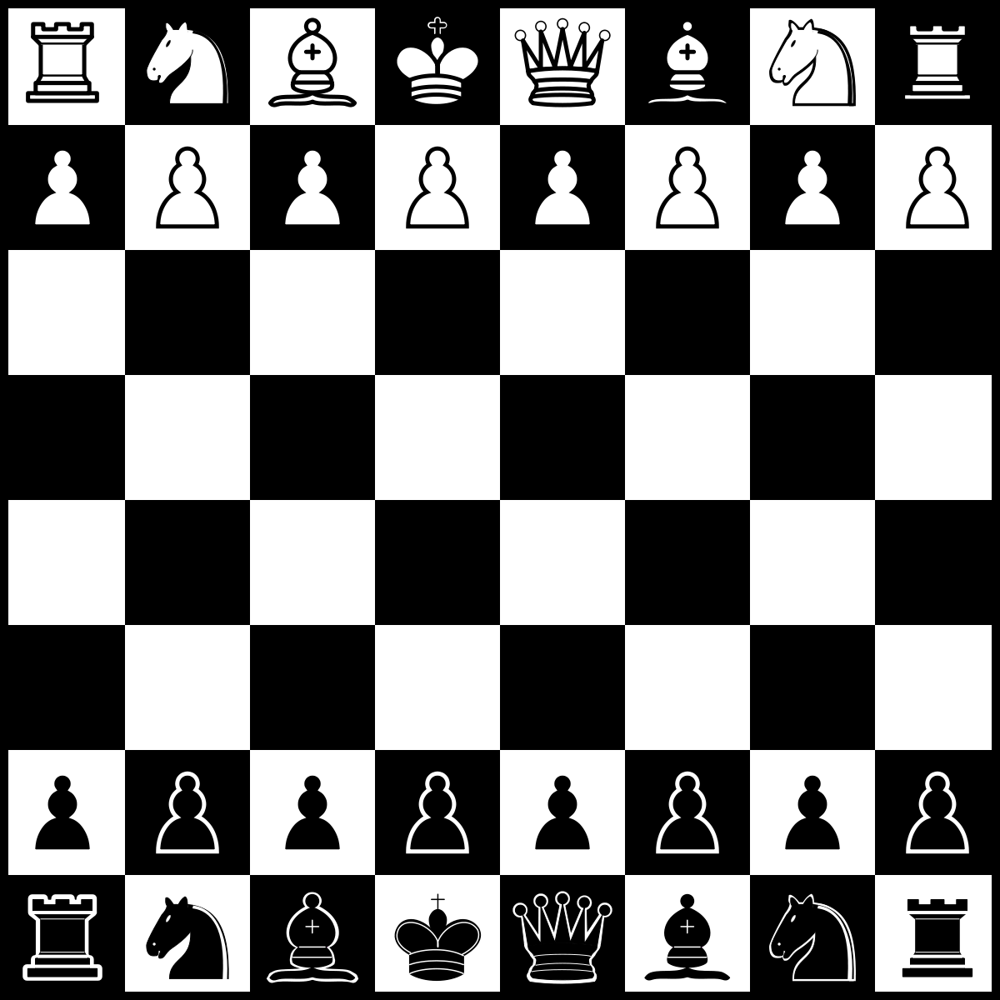

# Chess Engine with Minimax AI



This project is a chess engine with a Minimax AI implementation. The engine is designed to play chess, and it uses the Minimax algorithm with alpha-beta pruning for decision-making.

## Features

- A chess engine capable of playing against a human player.
- Minimax AI with alpha-beta pruning for intelligent move selection.
- A script for running chess tests for legal and illegal moves.

## Building the Project

1. Clone this repository to your local machine.
2. Navigate to the project directory.
3. Compile the code using your C++ compiler with
```bash
 make
```

## Running the Chess Engine
Execute the compiled binary:

```bash
./main
```
You can play against the AI, or play with a friend.

## Running Chess Tests
To run chess tests at different difficulty levels, use the provided script test-level.sh. The script takes the desired level as an argument (4, 5, or 6). For example, to test at level 5, run:

```bash
./test-level.sh 5
```
